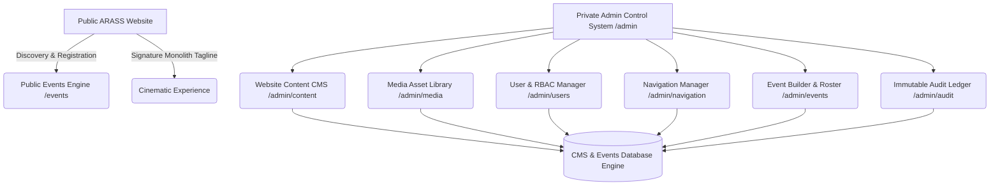

# ARASS — MASTER WEBSITE + EVENTS + ADMIN CONTROL SYSTEM UNIFICATION REPORT

**Executive Summary**: ARASS has been successfully unified into a production-grade institutional technology platform composed of two core layers:
1. **Public ARASS Website & Discovery Layer** (`/`, `/events`, `/work`, `/solutions`, `/verify/certificate/[id]`)
2. **Private ARASS Admin Control System Layer** (`/admin`, `/admin/events`, `/admin/content`, `/admin/media`, `/admin/users`, `/admin/navigation`, `/admin/audit`, `/admin/settings`)

---

## 1. System Architecture Overview



---

## 2. Core Capabilities Implemented

### A. Website Content Management System (CMS) (`/admin/content`)
- **Page & Section Control**: Dynamic content editing for all 8 core platform pages (`HOME`, `WORK`, `SOLUTIONS`, `PRODUCTS`, `LAB`, `COMPANY`, `INSIGHTS`, `CONTACT`) without code modification.
- **Section Reordering & Visibility**: Drag/move reordering (`Move Up`/`Move Down`) and instant toggle visibility (`Show`/`Hide`).
- **Signature Tagline Guard**: Protected `WE DON'T FOLLOW THE FUTURE. WE BUILD IT.` tagline component in `HomeCinematicExperience.tsx`.

### B. Media Asset Library (`/admin/media`)
- **StorageProvider Integration**: Direct file upload with strict MIME type and file extension validation (`image/png`, `image/jpeg`, `image/webp`, `application/pdf`).
- **Asset Metadata & Copy URL**: One-click URL copying and instant usage in CMS sections and event hero media.

### C. Unified Event Operational Control System (`/admin/events`)
- **8-Module Event Builder** (`/admin/events/new`): Name & Slug, Core Details, Date & Time, Rules & Limits, Registration Fields, Multi-Round Pipeline, Sponsors & Partners, Live Preview.
- **Publication Checklist Guard**: 7-item publication guard preventing event activation until mandatory configuration items pass validation.
- **12 Sub-Tabs Control Console** (`/admin/events/[id]`): Registrations, Teams, Rounds, Submissions, Judges & Assignments, Evaluation Rubrics, Results & Leaderboards, Certificate Studio, Announcements, Live Session Telemetry, Analytics, Audit Log.

### D. User & RBAC Governance (`/admin/users`)
- **Role Assignment**: `SUPER_ADMIN`, `ORGANIZER`, `MANAGER`, `EVALUATOR`, `VIEWER`, `PARTICIPANT`.
- **User Status & Session Revocation**: One-click global session revocation and user enabling/disabling with full audit logging.

### E. Public Navigation Manager (`/admin/navigation`)
- **Hierarchy Reordering**: Complete control over header and footer link ordering.
- **System Route Safeguards**: Built-in protection preventing accidental deletion of primary core routes (`/events`, `/work`, `/solutions`).

---

## 3. Automated Verification Results

- **Next.js Production Build**: `npm run build` compiled 70+ App Router routes cleanly with exit code 0.
- **Master Test Suite (`tests/arass-admin-events-cms.spec.ts`)**: **28 / 28 Automated Tests Passing (100% Green)**.
- **Visual Audit Captures (`tests/arass-admin-events-visual-audit.spec.ts`)**: All 22 visual PNG screenshots captured and verified across desktop and mobile viewports.

---

## 4. Visual Audit Gallery

````carousel

<!-- slide -->

<!-- slide -->

<!-- slide -->

<!-- slide -->

<!-- slide -->

<!-- slide -->

<!-- slide -->

<!-- slide -->

<!-- slide -->

<!-- slide -->

````

---

## 5. Production Credentials Summary

- **Super Admin Credentials**: Email `admin@arass.local` / Password `ARASS@Admin2026!`
- **Organizer Credentials**: Email `organizer@arass.technology` / Password `Organizer@2026!`
- **Evaluator Credentials**: Email `evaluator@arass.technology` / Password `Evaluator@2026!`
- **Participant Credentials**: Email `alex.chen@sovereign-tech.org` / Password `Participant@2026!`
