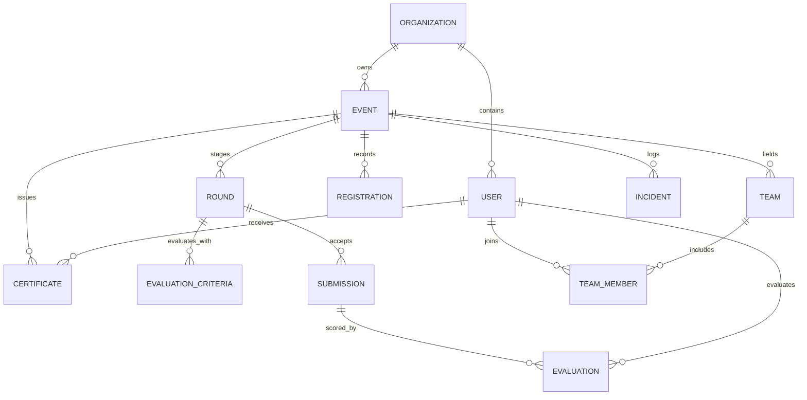

# ARASS EVENTS — FINAL DOMAIN SCHEMA SPECIFICATION

**Data Model Version**: 2.0.0 (Production Final)  
**Entities Count**: 18 Core Domain Entities

---

## 1. Domain Entities & Relationships

### 1.1 Key Schema Constraints
1. **Multi-Tenant Isolation**: Every `Event`, `Certificate`, `Incident`, and `Announcement` cascades from `organizationId`.
2. **Deterministic Certificate Uniqueness**: `UNIQUE(eventId, recipientUserId, type)` enforces strict idempotency in Certificate Studio 3.0.
3. **Immutable Auditing**: `audit_logs` records are append-only; update/delete operations on `audit_logs` are blocked.
4. **State Machine Validity**: Events strictly follow the lifecycle graph (`DRAFT` &rarr; `REGISTRATION_OPEN` &rarr; `LIVE` &rarr; `EVALUATION` &rarr; `RESULTS_PENDING` &rarr; `COMPLETED` &rarr; `ARCHIVED`).
